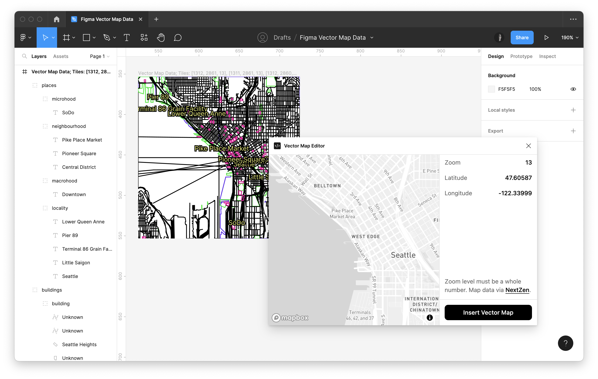

# Vector Map Data Importer Figma Plugin

This repository contains the source code for the Vector Map Exporter for Figma. The plugin requests vector map data from [Nextzen](https://www.nextzen.org/) and inserts the geometry and labels into the Figma document.

Once the vector data has been inserted, one can use it to design and prototype basemap styles directly within Figma.

## Development

- Run `yarn` to install dependencies.
- Run `yarn build:watch` to start webpack in watch mode.
- Open `Figma` -> `Plugins` -> `Development` -> `Import plugin from manifest...` and choose `manifest.json` file from this repo.

## Acknowledgment

The project was inspired by and includes code from [svg-exporter](https://github.com/hanbyul-here/svg-exporter) by [hanbyul-here](https://github.com/hanbyul-here).
